# MakePizza
Java사용 피자만들기 콘솔게임

캡처 이미지
-
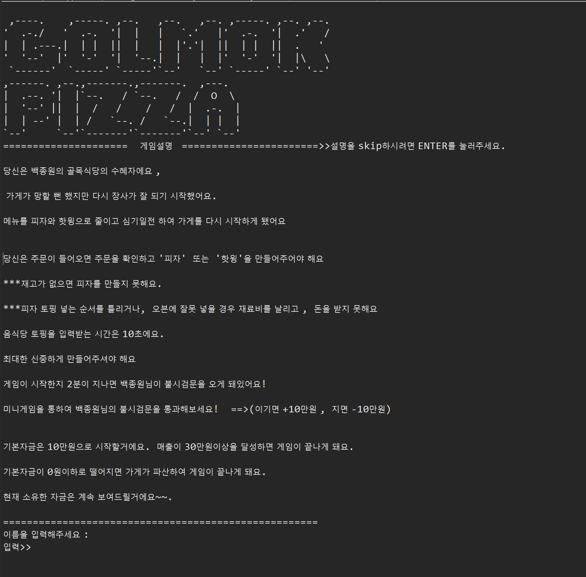
> ▲▲▲콘솔게임 시작 및 설명

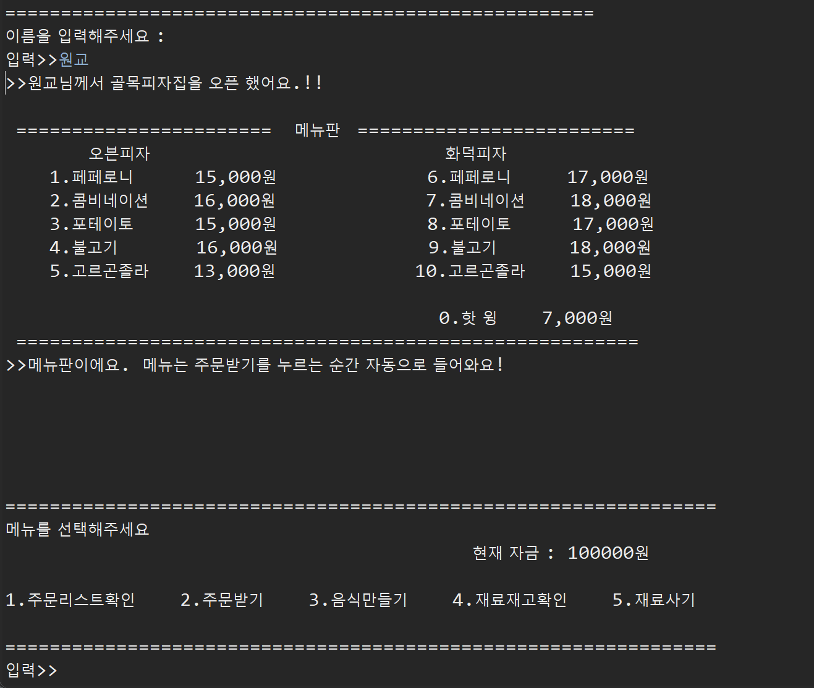
> ▲▲▲주문판

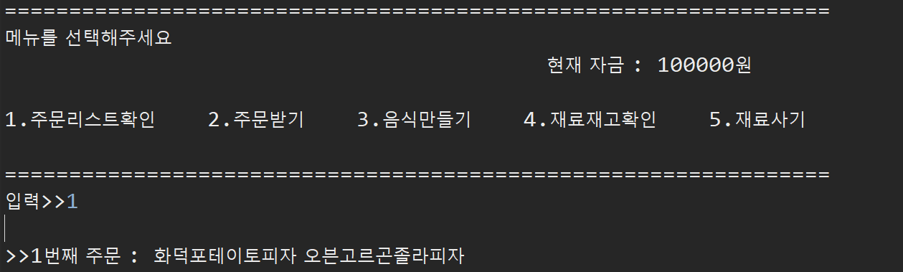
> ▲▲▲주문리스트 확인

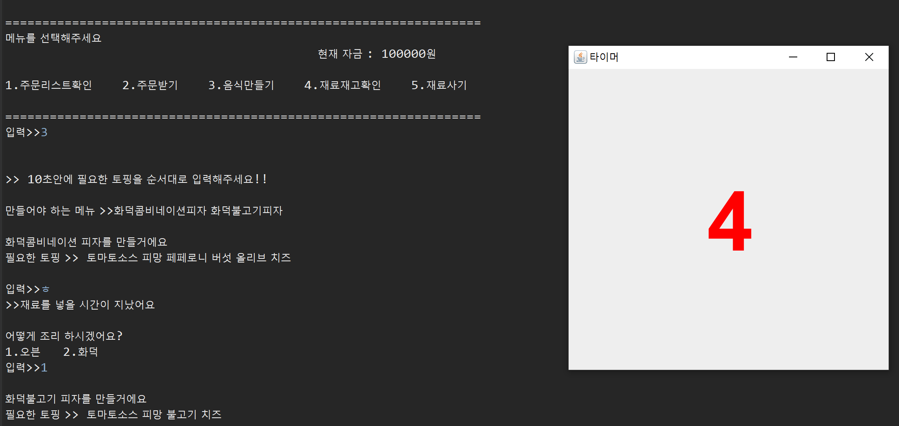
> ▲▲▲재료 타자입력으로 피자만들기

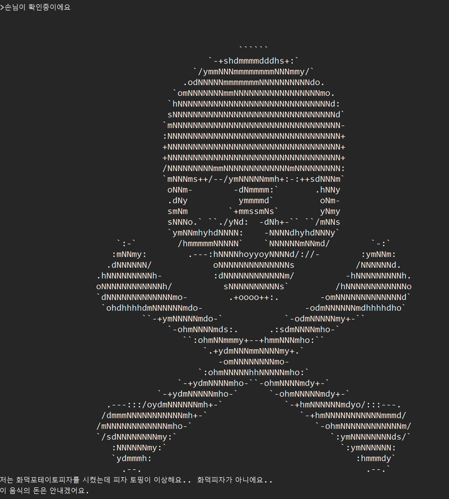
> ▲▲▲실패 화면

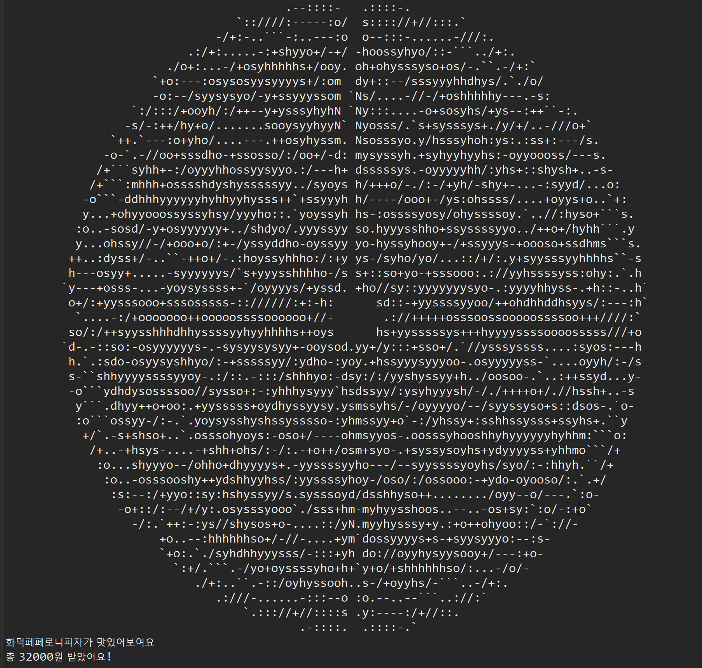
> ▲▲▲성공 화면

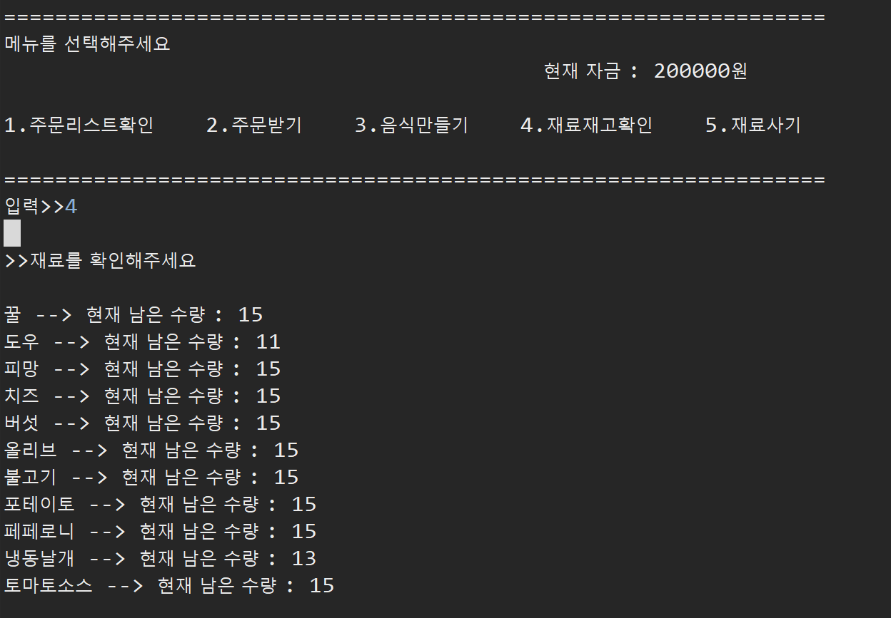
> ▲▲▲재료확인 

> ▲▲▲재료구매

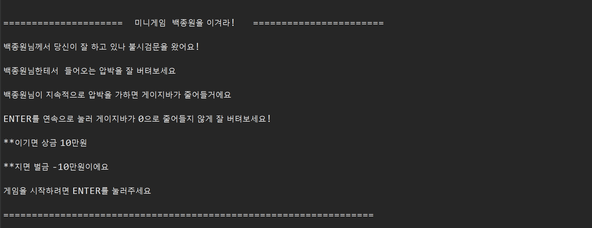
> ▲▲▲쓰레드 사용 미니게임 설명

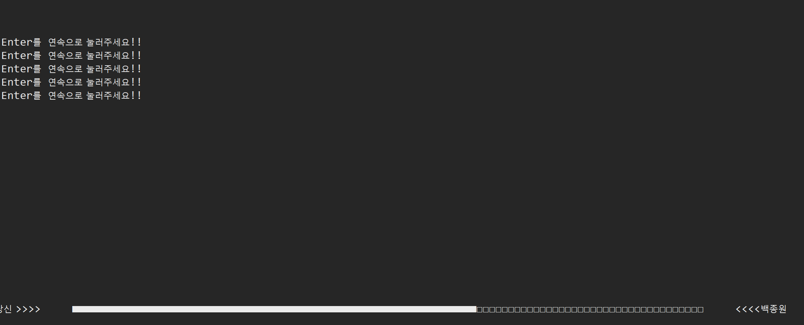
> ▲▲▲쓰레드 사용 미니게임 플레이

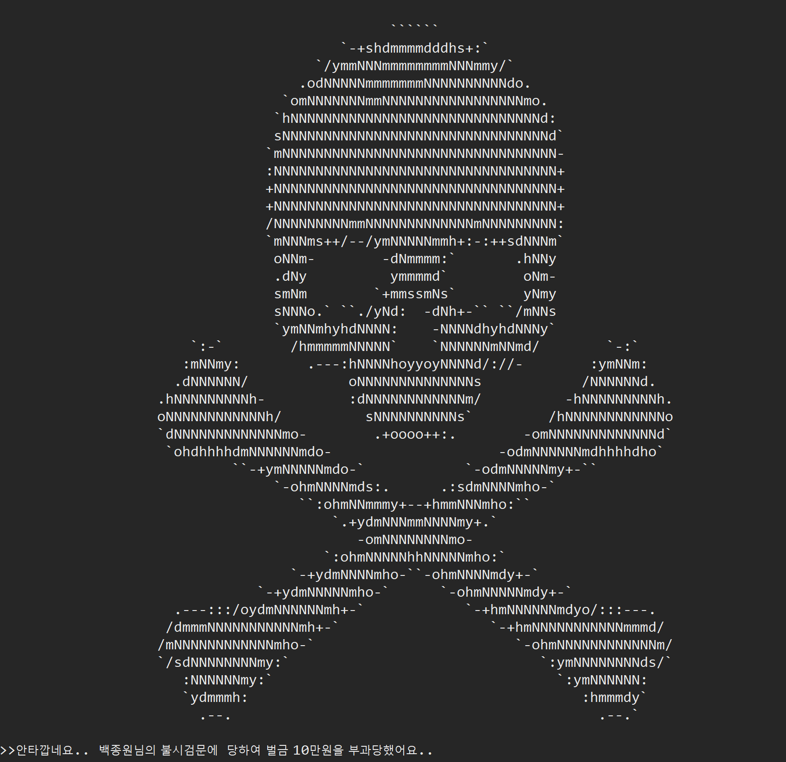
> ▲▲▲미니게임 실패

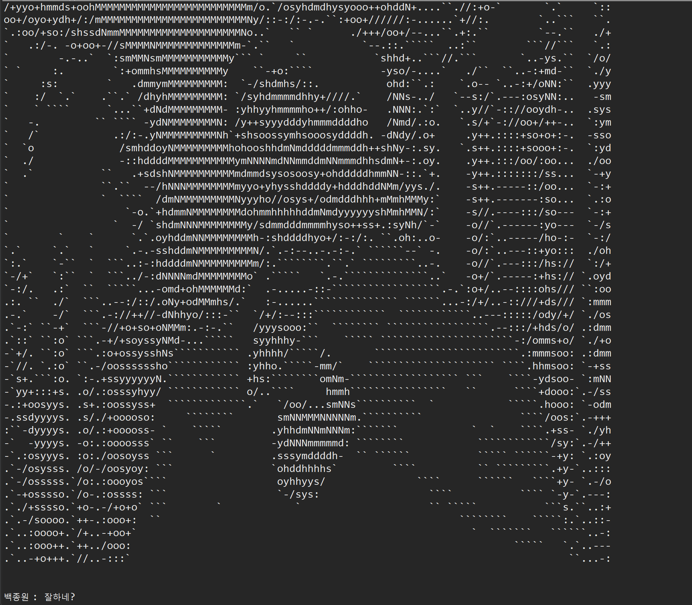
> ▲▲▲미니게임 성공

> ▲▲▲쓰레드 사용 미니게임 설명

> ▲▲▲쓰레드 사용 미니게임 플레이

> ▲▲▲미니게임 실패
