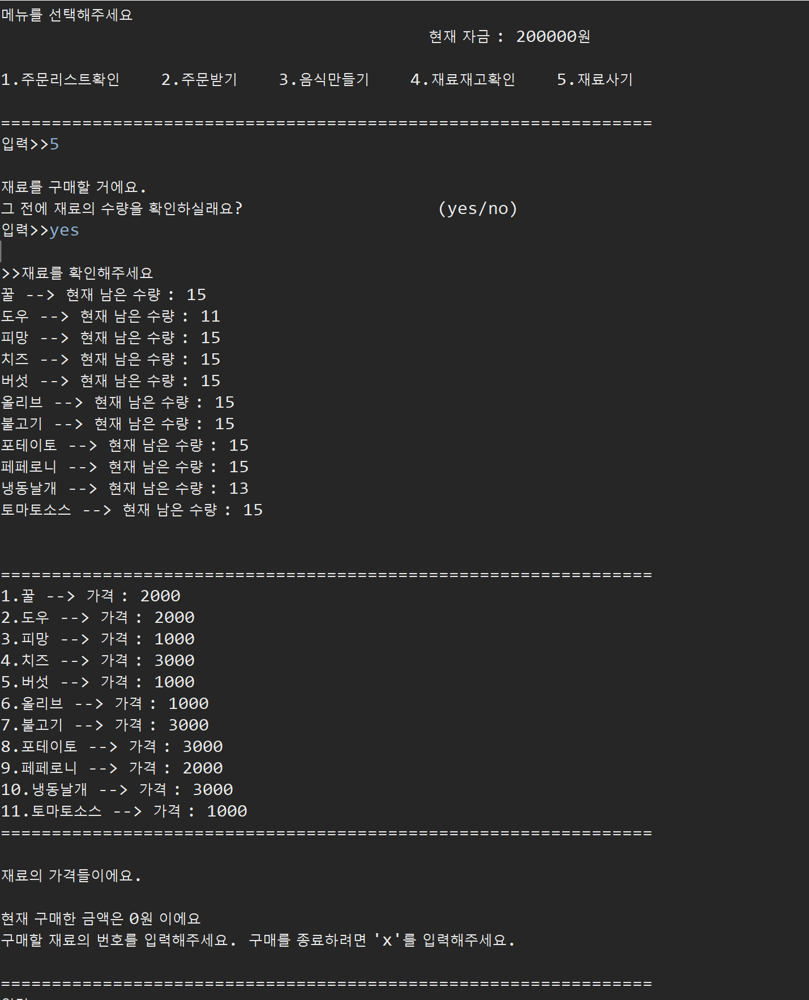

# MakePizza
Java사용 피자만들기 콘솔게임

캡처 이미지
-

> ▲▲▲콘솔게임 시작 및 설명

> ▲▲▲주문판

> ▲▲▲주문리스트 확인

> ▲▲▲재료 타자입력으로 피자만들기

> ▲▲▲실패 화면

> ▲▲▲성공 화면

> ▲▲▲재료확인 

> ▲▲▲재료구매

> ▲▲▲쓰레드 사용 미니게임 설명

> ▲▲▲쓰레드 사용 미니게임 플레이

> ▲▲▲미니게임 실패

> ▲▲▲미니게임 성공

> ▲▲▲쓰레드 사용 미니게임 설명

> ▲▲▲쓰레드 사용 미니게임 플레이

> ▲▲▲미니게임 실패
